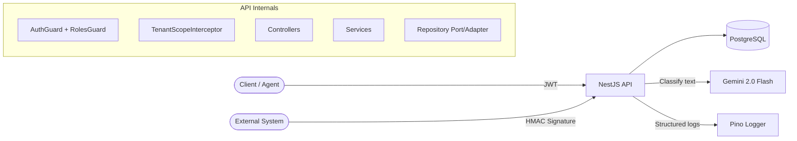

# FlowDesk API

[](https://github.com/eraykucukbas/flowdesk-api/actions/workflows/ci.yml)

Multi-tenant complaint and request management API with LLM-powered classification, webhook ingestion, and role-based access control.

## What It Does

FlowDesk is a **B2B support/request management API**. External customer messages arrive via webhooks (email, chat, forms), get automatically classified by an LLM, and are managed by support agents through the API. There is no end-customer portal — customers never interact with the system directly.

### User Model

- **ADMIN** — Tenant owner. Creates the tenant via registration, adds team members, can delete requests.
- **AGENT** — Support agent. Views requests, changes status, resolves tickets. Cannot delete.

### How Requests Arrive

1. **Webhook** — External systems (WhatsApp, email gateway, web forms) send messages to `POST /v1/webhooks/inbound`. The message is classified by an LLM and stored as a request. This is the primary intake channel.
2. **Manual entry** — Agents create requests via `POST /v1/requests` for phone calls or walk-ins.

### Onboarding

Self-service registration: `POST /v1/auth/register` creates a tenant and its first ADMIN user. The ADMIN then adds AGENT users via `POST /v1/users`. This follows the Slack/Linear model. A production B2B deployment would replace self-registration with operator-provisioned tenants (see [Known Limitations](#known-limitations)).

## Tech Stack

| Layer | Technology |
|---|---|
| Runtime | Node.js 24, TypeScript 5 |
| Framework | NestJS 11 |
| Database | PostgreSQL 16, TypeORM |
| Auth | JWT (access + refresh), argon2, Passport |
| LLM | Google Gemini 2.0 Flash |
| Logging | Pino (structured JSON, correlation ID) |
| Validation | class-validator, Zod (env) |
| Docs | Swagger/OpenAPI at `/docs` |
| CI | GitHub Actions |
| Deploy | Railway |

## Architecture



**Key architectural decisions:**

- **Feature-based modules** — not hexagonal/clean architecture layers. Port/adapter is a technique, not an architecture.
- **Port/adapter repositories** — interface (port) + TypeORM implementation (adapter), wired via Symbol token DI.
- **Rich entity** — `Request` has state transition methods (`markInProgress`, `markResolved`, `close`, `reopen`). Status is never assigned directly.
- **Shared-schema multi-tenancy** — `tenant_id` column on every scoped table, enforced at JWT → repository → response interceptor.

See [Architecture Decision Records](docs/adr/) for detailed rationale.

## Quick Start

```bash
# Clone and configure
git clone https://github.com/eraykucukbas/flowdesk-api.git
cd flowdesk-api
cp .env.example .env   # Edit with your values

# Start with Docker
docker compose up -d
make migration-run
make seed              # Optional: 2 tenants, 4 users, 5000 requests

# Verify
curl http://localhost:3000/health
```

## API Examples

```bash
# Register a new tenant
curl -X POST http://localhost:3000/v1/auth/register \
  -H "Content-Type: application/json" \
  -d '{"tenantName": "Acme Corp", "email": "admin@acme.com", "password": "secure123"}'

# Login
curl -X POST http://localhost:3000/v1/auth/login \
  -H "Content-Type: application/json" \
  -d '{"email": "admin@acme.com", "password": "secure123"}'

# Create a request (use accessToken from login)
curl -X POST http://localhost:3000/v1/requests \
  -H "Authorization: Bearer <accessToken>" \
  -H "Content-Type: application/json" \
  -d '{"title": "Order delayed", "body": "My order #123 has not arrived", "channel": "EMAIL"}'

# List requests with pagination
curl http://localhost:3000/v1/requests?limit=10 \
  -H "Authorization: Bearer <accessToken>"

# Change request status
curl -X PATCH http://localhost:3000/v1/requests/<id>/status \
  -H "Authorization: Bearer <accessToken>" \
  -H "Content-Type: application/json" \
  -d '{"status": "IN_PROGRESS"}'
```

## Swagger

Interactive API documentation is available at `/docs` on any running instance.

## Running Tests

```bash
# Unit tests
make test

# E2E + integration tests (requires running Postgres)
make test-e2e

# Unit test coverage
npm run test:cov
```

**Test summary:** 28+ tests across 4 test suites:
- Unit tests — ClassificationService with mocked LLM (5 tests)
- Integration tests — tenant scope at repository layer with real Postgres (7 tests)
- E2E happy path — full API lifecycle: auth → CRUD → RBAC → webhook → idempotency (16 tests)
- E2E tenant isolation — cross-tenant access returns 404 (8 tests)
- E2E SQL injection — 4 attack vectors, all blocked (8 tests)

## Project Structure

```
src/
  common/           Decorators, guards, filters, interceptors
  config/           Environment validation (Zod)
  database/         Migrations, seeds, data source
  modules/
    auth/           Register, login, refresh, logout (JWT + argon2)
    tenants/        Tenant entity, repository port/adapter
    users/          User entity, ADMIN creates AGENTs
    requests/       Request CRUD, state machine, cursor pagination
    webhooks/       Inbound webhook, HMAC guard, idempotency
    classification/ LLM classifier port/adapter (Gemini), prompt versioning
    health/         Health check endpoint
```

## Known Limitations

- **Onboarding:** Registration is self-service — the first user creates a tenant and becomes its admin, then adds team members via `POST /v1/users` (Slack/Linear model). A B2B deployment with operator-provisioned tenants would expose a SUPER_ADMIN-only tenant creation endpoint and remove self-registration.

- **Sessions:** Refresh tokens are stored as a single hashed column on the user, allowing one active session per user. Multi-device support would require a separate `refresh_tokens` table with one row per session, enabling per-device revocation and token reuse detection.

- **Email uniqueness:** Email is globally unique. In production it would be scoped per tenant, with the tenant resolved at login via subdomain or explicit selection.

- **Soft delete + unique constraints:** Soft-deleted rows still occupy unique constraints (email, slug, externalMessageId). A production system would use partial unique indexes (`WHERE deleted_at IS NULL`).

- **Category/channel as enums:** These are enums for scope reasons. In a multi-tenant product where tenants define their own categories, they would be lookup tables with per-tenant scoping. Status and role remain enums by design — they are tied to workflow and authorization logic.

- **Pagination:** Cursor-only. Admin interfaces requiring page numbers and total counts would need an offset strategy alongside it, selected via query parameters (Strategy pattern).

- **No queue / cache / metrics:** Deliberately out of scope for v0.1 — see [ADR-004](docs/adr/004-synchronous-llm.md) and v0.2 plan below.

## v0.2 Roadmap

- Redis cache-aside with TTL + invalidation
- BullMQ job queue for async LLM classification (webhook returns 202)
- Retry with exponential backoff + jitter, dead-letter queue
- n8n example workflow
